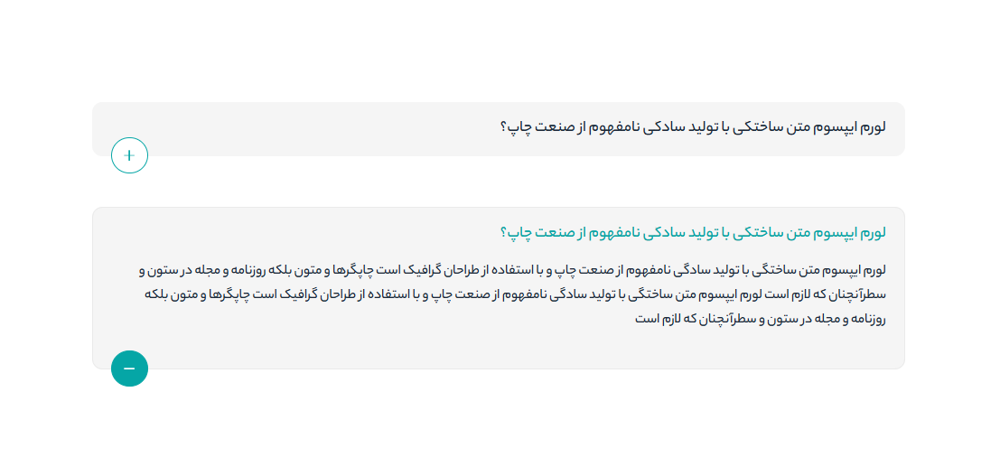

# 📂 Accordion Component

Hi! This is a clean and modern accordion component built using **HTML**, **CSS**, and **JavaScript**. It’s fully **RTL-compatible**, features **Persian typography**, and uses SVG icons for toggle states.

&nbsp;

## 📸 Preview

&nbsp;

## ✨ Features

- Elegant and minimal accordion design  
- Smooth open/close interaction  
- Fully RTL and Persian-friendly layout  
- Toggle icons using SVG (plus/minus)  
- Uses CSS variables and custom font  

&nbsp;

## 🛠️ Technologies Used

- HTML5  
- CSS3 with custom properties  
- JavaScript  
- Persian font: YekanBakh  
- SVG icons for visual state control  

&nbsp;

## 🤝 Contact Me
If you have questions, feedback, or want to collaborate:

   

 
&nbsp;

## 🙏 Thanks
Thanks for checking out this project. If you found it helpful, feel free to give it a ⭐️ or share your feedback. ❤️
